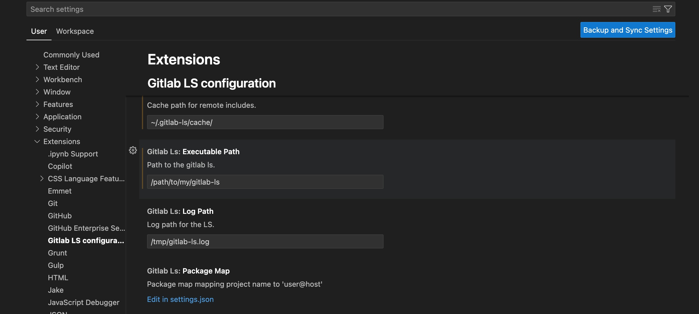

# Gitlab language server

## **This is not an official language server.**

I've developed this LSP to avoid manually searching for extend definitions and
navigating to code that is held in remote files.

## Functionalities

Currently it supports only:

- _textDocument/definition_: [Link](https://microsoft.github.io/language-server-protocol/specifications/lsp/3.17/specification/#textDocument_definition)
- _textDocument/hover_: [Link](https://microsoft.github.io/language-server-protocol/specifications/lsp/3.17/specification/#textDocument_hover)
- _textDocument/completion_: [Link](https://microsoft.github.io/language-server-protocol/specifications/lsp/3.17/specification/#textDocument_completion)

## Definition

For remote file includes it tries to download referenced git repository and
then use its files to jump to definition.

To clone the repository it currently only supports ssh protocol and it
automatically tries to use SSH key in SSH agent.

## Build

```sh
  cargo build --release
```

Executable can then be found at _target/release/gitlab-ls_

## Integration with Neovim

Currently this tool isn't available on Mason but if there will be
interest I will be add it.

If you want to include it to test it you can use:

```lua
vim.api.nvim_create_autocmd("FileType", {
  pattern = "yaml",
  callback = function(_)
    local root_dir = vim.fs.find(".git", { upward = true, path = vim.fn.expand("%:p:h") })[1]

    if root_dir then
      root_dir = vim.fn.fnamemodify(root_dir, ":h")
    end

    local client = vim.lsp.start_client({
      name = "gitlab-ls",
      cmd = { "path-to-gitlab-ls" },
      init_options = {
        cache = "path to cache folder that will hold remote files",
        log_path = "logging directory",
        package_map = {
          ["project_name"] = "sshuser@host",
        },
      },
      root_dir = root_dir,
      on_attach = require("lazyvim.plugins.lsp.keymaps").on_attach,
    })

    if not client then
      vim.notify("error creating LSP config")
      return
    end

    vim.lsp.buf_attach_client(0, client)
  end,
})
```

## Integration with VSCode

Extension hasn't been published to marketplace yet.

To use this extension you need to build and install it manually.

First:

```bash
npm install -g @vscode/vsce
```

Then:

```bash
cd ./vscode-extension/ && vsce package
```

This command will output .vsix file that can then be imported to vscode extensions like described [here](https://code.visualstudio.com/docs/editor/extension-marketplace#_install-from-a-vsix).

This extension supports configuration which needs to be set up because _gitlab-ls_ itself isn't installed along with the extension but it needs to be downloaded from releases or built from source.


